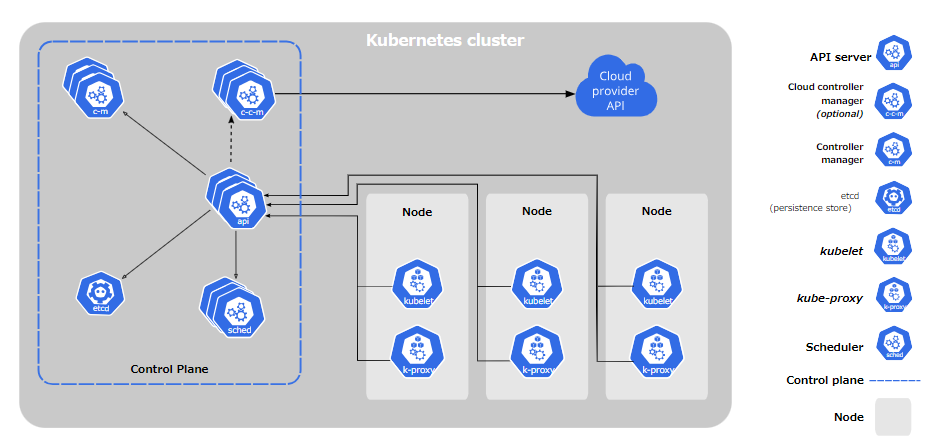
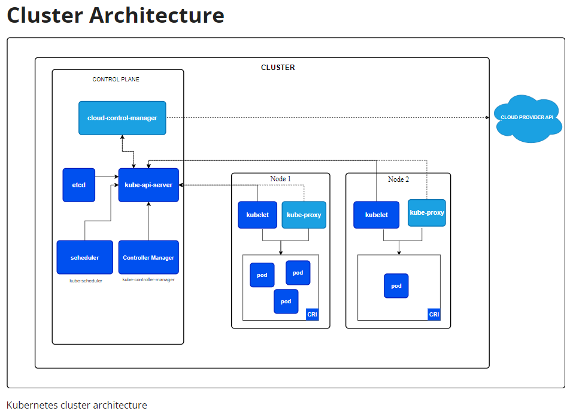
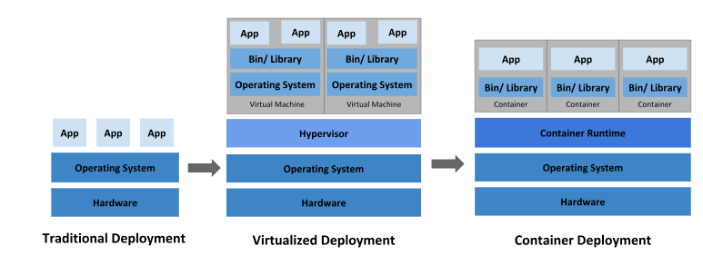

# What's Kubenertes?
- Kubernetes is a portable, extensible, open source platform for managing containerized workloads and services, that facilitates both declarative configuration and automation. 

- **cluster**: A Kubernetes cluster consists of a set of worker machines, called nodes
    - **nodes**: run containerized applications. The worker node(s) host the Pods
        - **pods**: the components of the application workload.
        - **kubelet**: An agent that runs on each node in the cluster. It makes sure that containers are running in a Pod.
        - **kube-proxy**: a network proxy that runs on each node in your cluster, implementing part of the Kubernetes Service concept.
        - **Container runtime**: empowers Kubernetes to run containers effectively
    - **control plane**: manages the worker nodes and the Pods in the cluster. In production environments, the control plane usually runs across multiple computers and a cluster usually runs multiple nodes, providing fault-tolerance and high availability.
        - **kube-apiserver**: the front end for the Kubernetes control plane.
        - **etcd**: Consistent and highly-available key value store used as Kubernetes' backing store for all cluster data.
        - **kube-scheduler**: watches for newly created Pods with no assigned node, and selects a node for them to run on.
        - **kube-controller-manager**: runs controller processes.
            - **Node controller**: Responsible for noticing and responding when nodes go down.
            - **Job controller**: Watches for Job objects that represent one-off tasks, then creates Pods to run those tasks to completion.
            - **EndpointSlice controller**: Populates EndpointSlice objects (to provide a link between Services and Pods).
            - **ServiceAccount controller**: Create default ServiceAccounts for new namespaces.
        - **cloud-controller-manager**: 
            - **Node controller**: For checking the cloud provider to determine if a node has been deleted in the cloud after it stops responding
            - **Route controller**: For setting up routes in the underlying cloud infrastructure
            - **Service controller**: For creating, updating and deleting cloud provider load balancers

# Why Kubenertes?
- Container is good way to bundle and run your app but it has some problems and K8s resolve them:
    - Service discovery and load balancing
    - Storage orchestration
    - Automated rollouts and rollbacks
    - etc
